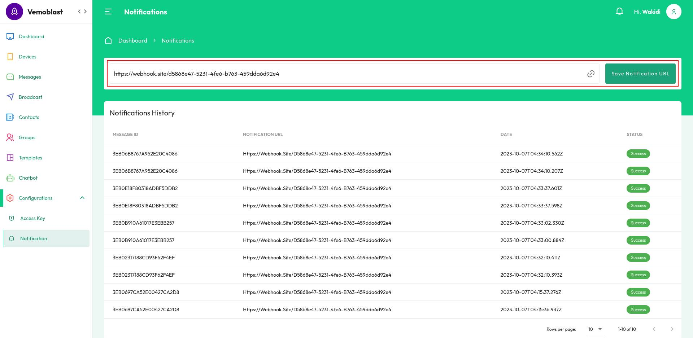

# Getting Started

To get started with vemoblas API, follow the steps given below.

1. Login to your **Dashboard**
2. Go to **Access Key** under **Developer** menu.
3. Retrieve API access Keys.

## Authorization

To ensure secure client server communication, every API call should be authorized. Out of the various Authorization methods available, Vemoblat uses BASIC AUTH. The format for BASIC AUTH is Username:Password. Using BASIC AUTH, API key can be passed as either Username or Password. For Vemoblat, API key is passed as the Username, paired with an empty value for Password. It is then encoded into Base64 format and used as the authorization header.

<h6>Authorization <span class="font-regular">Basic Auth</span></h6>

<table class="no-border">
    <tr>
        <td width="200">Username</td>
        <td>Your secret ID</td>
    </tr>
    <tr>
        <td>Password</td>
        <td>Your client ID</td>
    </tr>
</table>

###### Request Headers

<table class="no-border">
    <tr>
        <td width="200">x-api-key</td>
        <td>Vemoblast API key</td>
    </tr>
</table>

## Send Message

<pre class="pre">
<strong class="method-post">POST</strong> https://api.blast.vemobo.com/v1/chat/messages
</pre>

###### Body

<table class="no-border">
    <tr>
        <td width="200">sendTo</td>
        <td>Whatsapp number (international number)</td>
    </tr>
    <tr>
        <td>type</td>
        <td>Type of message (text, media, contacts, buttons, list)</td>
    </tr>
    <tr>
        <td>body</td>
        <td>Content of message</td>
    </tr>
    <tr>
        <td>media</td>
        <td>Url media</td>
    </tr>
    <tr>
        <td>title</td>
        <td>Title of message</td>
    </tr>
    <tr>
        <td>footer</td>
        <td>Footer of message</td>
    </tr>
    <tr>
        <td>contacts</td>
        <td>Array of contacts</td>
    </tr>
    <tr>
        <td>buttons</td>
        <td>Array of buttons</td>
    </tr>
    <tr>
        <td>listSections</td>
        <td>Array of listSections</td>
    </tr>
    <tr>
        <td>listButtonText</td>
        <td>Text for list button</td>
    </tr>
    <tr>
        <td>chatGroupId</td>
        <td>Optional for grouping message</td>
    </tr>
    <tr>
        <td>refId</td>
        <td>Optional for reference message</td>
    </tr>
    <tr>
        <td>refUser</td>
        <td>Optional to track your user message</td>
    </tr>
</table>

###### Success-Response

```
{
    "status": "success",
    "message": "Successful",
    "data": {
        "id": "2a698cad-fd1f-4351-a94b-f44a3fc51cad",
        "status": "pending"
    }
}
```

### Text Message

##### Body

```
{
    "sendTo": "6285743603987",
    "type": "text",
    "body": "Hello world"
}
```

### Media Message

##### Body

```
{
    "sendTo": "6285743603987",
    "type": "text",
    "body": "Hello world",
    "media": "https://picsum.photos/seed/picsum/200/300"
}
```

## Messages

Retrieve a list of messages or get specific message

### Get Messages

<pre class="pre">
<strong class="method-get">GET</strong> https://api.blast.vemobo.com/v1/messages
</pre>

### Get Specific Message

<pre class="pre">
<strong class="method-get">GET</strong> https://api.blast.vemobo.com/v1/messages/:id
</pre>

## Webhook

To receive notifications of messages ack, HTTP notifications are configured as explained in the steps given below.

1. Login to your **[Console](https://console.blast.vemobo.com)**
2. On the Home page, go to **Configurations > Notification**.
3. Enter webhook URL.
4. Click Save Notification URL.

<br/>

<br/>

> #### NOTE
>
> URL protocol prefix `https://` or `http://` are required. We highly recommended to use `https://` for security purposes.

### Verifying Notification Authenticity

To ensure the integrity of the notifications and the content, it is recommended to verify the notification using signatur_key.

#### Verifying Signature Key

In the notification response body, Vemoblast provides signature_key which is generated by appending messageId and ServerKey into a string. ServerKey is confidential information known only to Vemoblast and you. Thus, you can verify the signature_key to ensure that the notification is signed by Vemoblast.

The logic to generate or calculate signature_key is explained below:

`SHA512(messageId+ServerKey)`

> It basically means append the value of messageId and ServerKey into one string, then use it as input to SHA512 hash function. Then the output should match with signature_key from notification.

#### Sample Response

```
{
  "id": "2f46c8a1-acaf-4a77-95c1-36542367048e",
  "message_id": "3EB06B8767A952E20C4086",
  "ack": "ACK_DEVICE",
  "from": "6289627784235",
  "to": "6285743603758",
  "ref_id": "",
  "chat_group_id": "",
  "ref_user": "",
  "signature_key": "270ea41cb5c19fb535968d560b027efab5b6d48d7a0c38f0aa2b7e5a6afdd3c98b3a40de5b4a27dadb75100e8547dc7ecc22a8fae4f88e11ddc1e28156b43752"
}
```